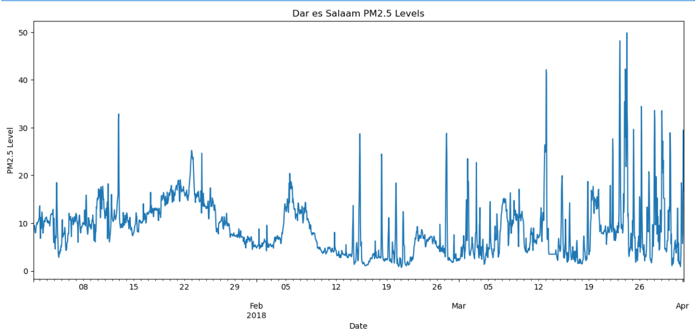
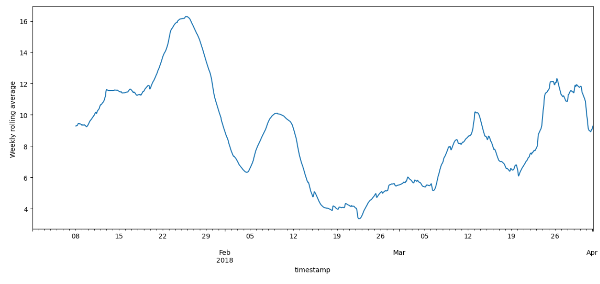
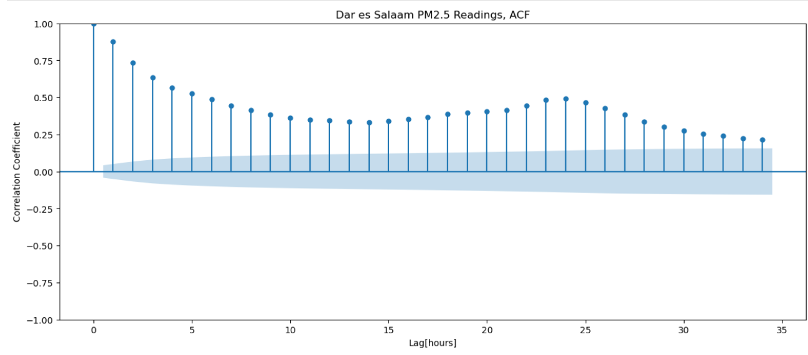
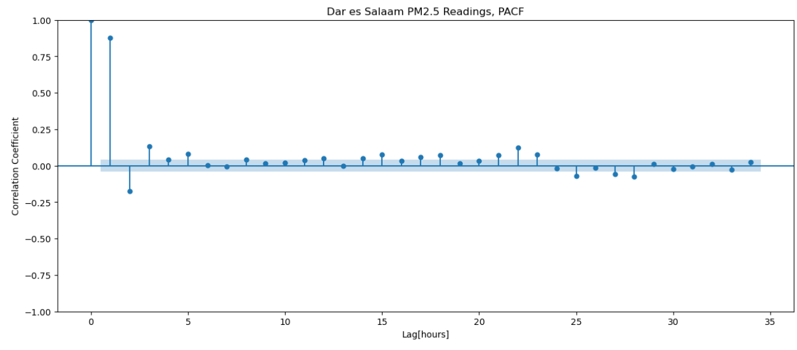
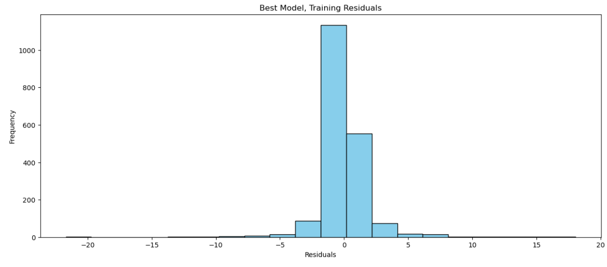
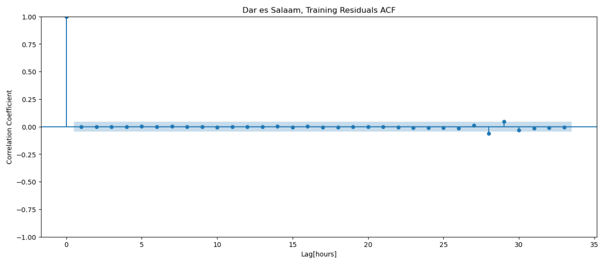
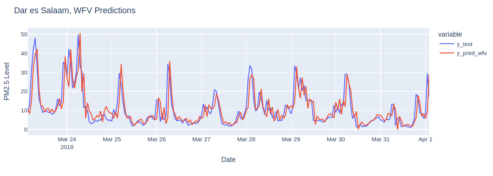

# Air Quality Analyzing in Dar es Salaam tanzania 🇹🇿
Welcome👋, In this project, we will work with data from one of Africa's largest open data platforms [Open Africa](https://open.africa/dataset/sensorsafrica-airquality-archive-dar-es-salaam). we will look at air quality data from Dar es Salaam in Tanzania; and build a time seriesmodel to predict PM 2.5 readings throughout the day🚀.

## Project Overview 

- **Get data by querying a MongoDB database 📊🔍**

- **Prepare time series data for analysis 📈🕒**

- **Build an autoregression model 🔨📈**

- **Improve a model by tuning its hyperparameters 🛠️🎚️**

## Key Insights

- **Time series plot of the readings**
  

- **Weekly roling average plot**

- **AutoCorrelation Function plot**

- **Partial AutoCorrelation Function plot**

- **Best model training residuals histogram**

- **ACF training residuals**

- **WTF Predictions Plot**

## Resources

- **<a href ="https://open.africa/dataset/sensorsafrica-airquality-archive-dar-es-salaam">Click  here to access to the open source data (openAfrica) </a>**
- **<a href ="https://github.com/Younes202/Air-Quality-Analyzing-in-Dar-es-Salaam-/blob/main/notebooks/project_representation.ipynb"> Click here to access to the Code source of my Project </a>**

## Contact
##### Feel free to reach out me on linkedin <a href="https://www.linkedin.com/in/younes-sghyer-08144119b/"> Younes Sghyer </a> if you have any questions or suggestions for improvement or collaboration. Thank you for visiting my repository!
